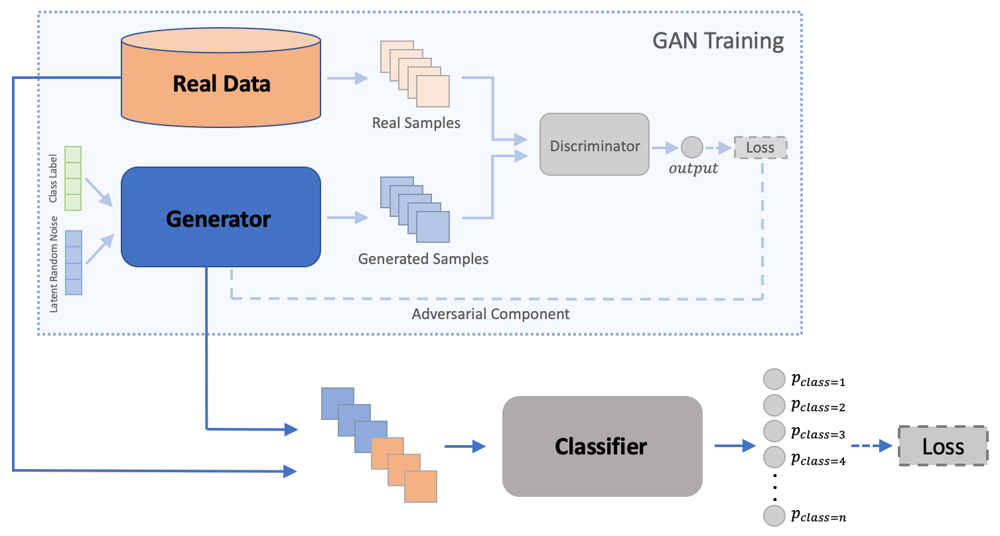
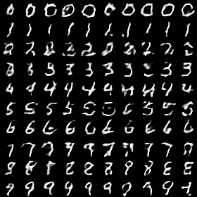
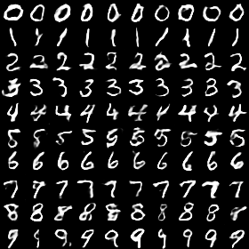
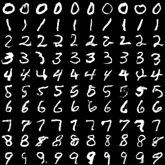
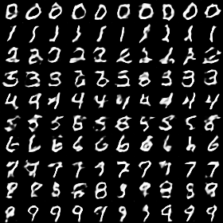
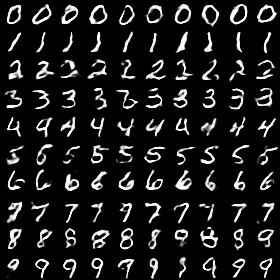
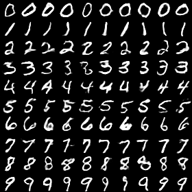
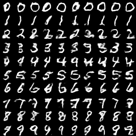
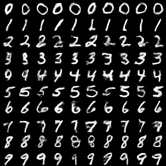
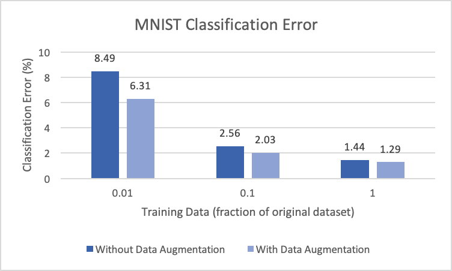

# Data Augmentation using Generative Adversarial Networks

Project for 2019 Regeneron Science Talent Search ([paper](https://drive.google.com/file/d/1-AdguaHoTb9-5ODO-mIdP0eby8zSpOJo/view?usp=sharing))

Main idea: Designed framework to synthesize training samples using Conditional Wasserstein GAN in order to improve accuracy of digit classifier.

Reduced classification error by 10.4% on full MNIST dataset; achieved comparable accuracy (98.0% vs. 98.6%) while only using 1/10 of the original dataset (code implementation: github.com/agongt408/science-fair)

## Results

Full data (2500, 5000, 10000 training episodes)

10% data (2500, 5000, 10000 training episodes)

1% data (2500, 5000, 10000 training episodes)

